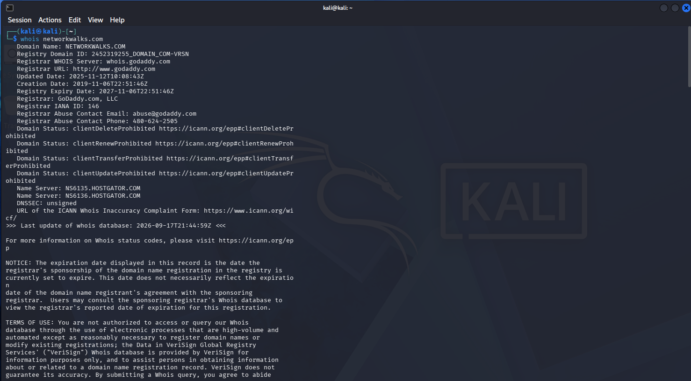
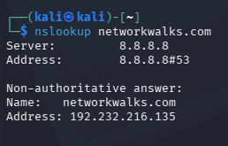
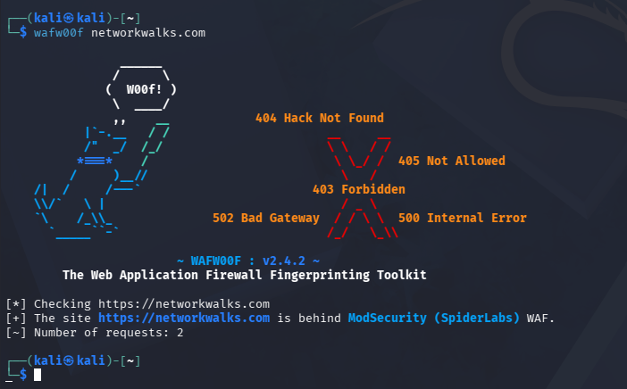

# Footprinting & Network Scanning — Cybersecurity Internship Project

This repository documents a Week 2 practical exercise from my Cybersecurity & Ethical Hacking internship, covering authorized domain footprinting and local network host discovery.

## Project Objectives
- Perform authorized reconnaissance against a designated web target using Kali Linux
- Identify domain registration, DNS, server, and technology details
- Discover live hosts on a local network and map the results
- Document everything in a way that connects findings to real-world risk, without overstating them as confirmed vulnerabilities

## Lab Environment

| Component | Details |
|---|---|
| OS | Kali Linux |
| Web Reconnaissance Target | networkwalks.com |
| Local Network | 192.168.1.0/24 |
| Network Scanner | Nmap / Zenmap |

## Tools Used
- WHOIS
- WhatWeb
- Nslookup
- cURL
- WAFW00F
- DNSRecon
- Nmap / Zenmap

## Part 1: Footprinting

### WHOIS — Domain Registration Lookup
**Command:** `whois networkwalks.com`

Pulled back the standard public registration details: registrar (GoDaddy), domain creation date (2019-11-06), expiry (2027-11-06), name servers (ns6135.hostgator.com and ns6136.hostgator.com, alongside GoDaddy's own domaincontrol servers), and confirmation that DNSSEC is unsigned. Registrant contact details were privacy-protected via Domains By Proxy, so no personal registrant info was exposed.

### WhatWeb — Technology Fingerprinting
**Command:** `whatweb networkwalks.com`

This is where most of the useful detail came from. The site runs on Apache and WordPress (version 7.1.1), with the WP Download Manager plugin (3.3.58) and Bootstrap/jQuery in the front end. It also confirmed the HTTP-to-HTTPS redirect, Google Tag Manager, and a public contact email in the page metadata. None of this confirms a vulnerability on its own, but named software versions are exactly the kind of detail that would matter in a deeper, authorized assessment.

### Nslookup — DNS Resolution
**Command:** `nslookup networkwalks.com`

Resolved cleanly to `192.232.216.135` via Google's public DNS (8.8.8.8). Simple step, but it's the anchor point for anything else you'd want to look at on the network side.

### cURL — HTTP Header Inspection
**Command:** `curl -I https://networkwalks.com`

Got back an `HTTP/2 200` along with headers confirming Apache as the server and WordPress-related paths (`/wp-json/`) in the response. A cookie was set on the response, but I'm leaving that value out of this write-up rather than publishing it in a public repo.

### WAFW00F — WAF Detection
**Command:** `wafw00f https://networkwalks.com`

Confirmed the site sits behind **ModSecurity (SpiderLabs)**. Good to know for context, but a WAF being present doesn't mean the application behind it is fully secure — it's one layer, not a guarantee.

### DNSRecon — DNS Enumeration
**Command:** `dnsrecon -d networkwalks.com`

## Footprinting Findings Summary

| Task | Tool | Key Finding |
|---|---|---|
| 1 | WHOIS | GoDaddy registrar, Hostgator name servers, DNSSEC unsigned |
| 2 | WhatWeb | Apache, WordPress 7.1.1, WP Download Manager, jQuery, Bootstrap |
| 3 | Nslookup | networkwalks.com → 192.232.216.135 |
| 4 | cURL | Apache, HTTP/2, WordPress REST API path exposed |
| 5 | WAFW00F | ModSecurity (SpiderLabs) detected |
| 6 | DNSRecon | *pending* |

## Part 2: Network Scanning

### Local Network Identification
Checked my machine's network config and confirmed the subnet in use: **192.168.1.0/24**, with my device at 192.168.1.25 and the gateway at 192.168.1.1.

### Host Discovery
**Command:** `nmap -sn 192.168.1.0/24`

The scan checked all 256 addresses in the range and found **6 live hosts**:

| IP Address | Hostname | Notes |
|---|---|---|
| 192.168.1.1 | vodafone.broadband | Router/gateway |
| 192.168.1.20 | Galaxy-A07.broadband | Personal phone |
| 192.168.1.62 | iPhone-5.broadband | Personal phone |
| 192.168.1.140 | — | MAC traced to Hikvision — likely a network camera |
| 192.168.1.196 | — | No hostname returned |
| 192.168.1.25 | DESKTOP-MJSKLGF.broadband | My own machine |

### Network Topology
Generated a topology map in Zenmap after the scan. Interestingly, it surfaced one extra host — **192.168.1.200** — that hadn't shown up in the original CLI sweep, which is worth a follow-up scan to confirm whether it's a device that connects intermittently.

## Network Scanning Findings Summary

| Task | Activity | Result |
|---|---|---|
| 1 | Local IP/subnet identification | 192.168.1.0/24 |
| 2 | Live host discovery | 6 hosts found (out of 256 scanned) |
| 3 | MAC/vendor identification | Router, 2 phones, 1 desktop, 1 unidentified IoT (Hikvision), 1 unnamed device |
| 4 | Topology mapping | Generated in Zenmap; revealed 1 additional host not seen in the CLI scan |

## Risk Observations

| # | Finding | Risk |
|---|---|---|
| 1 | Web technology stack exposed (CMS + plugin versions) | Medium |
| 2 | Server IP identifiable via DNS resolution | Low |
| 3 | HTTP headers reveal backend platform and API paths | Low |
| 4 | WAF identifiable | Low |
| 5 | Unmanaged IoT device (likely a camera) on local network | Medium |
| 6 | Flat network with no segmentation between personal and IoT devices | Medium |

None of these are confirmed vulnerabilities — this was reconnaissance and host discovery only, not exploitation or active vulnerability testing. Each finding is information that a further, authorized assessment would need to investigate before drawing conclusions about real risk.

## Key Takeaways
Working through both halves of this exercise made it clear how much information is available about a system before anyone even attempts to interact with it directly — a handful of standard, non-intrusive commands were enough to build a fairly detailed picture of both an external domain and my own home network. It also reinforced why documentation matters as much as the technical work itself: a finding is only useful if it's written up in a way that explains what it means and why it matters, not just what command produced it.

## Security & Ethical Considerations
All footprinting activity in this project was carried out against a domain provided as part of an authorized training exercise. All network scanning was limited to my own home network. None of the tools or techniques documented here should be run against any system without the owner's explicit permission.

## Author
Favour Ayang
Cybersecurity & Ethical Hacking Trainee

🔗 LinkedIn: www.linkedin.com/in/favour-ayang-5b15422a5
💻 GitHub: https://github.com/favourayang1-coder)
